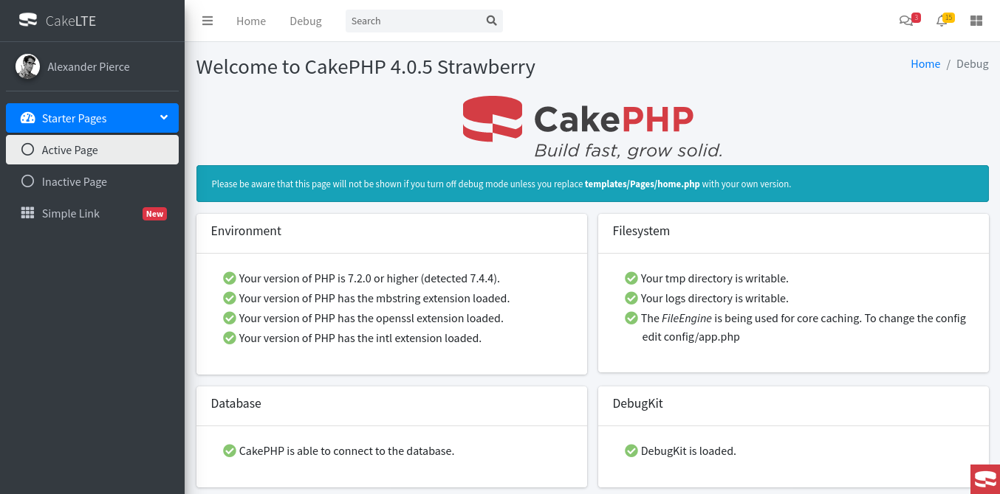

# CakeLTE: AdminLTE plugin for CakePHP 4.x

## Installation

You can install this plugin into your CakePHP application using [composer](https://getcomposer.org).

The recommended way to install composer packages is:
```bash
composer require arodu/cakelte
```

## Configuration

You can load the plugin using the shell command:

```bash
<<<<<<< HEAD
bin/cake plugin load CakeLte
=======
bin/cake plugin load CakeLTE
>>>>>>> 9b5798c8e39feac04f1c1ea5c7c5c4bb4330ee15
```

Or you can manually add the loading statement in the `src/Application.php` file of your application:

```php
public function bootstrap(){
    parent::bootstrap();
<<<<<<< HEAD
    $this->addPlugin('CakeLte');
=======
    $this->addPlugin('CakeLTE');
>>>>>>> 9b5798c8e39feac04f1c1ea5c7c5c4bb4330ee15
}
```

## How to use

use traint into `src/View/AppView.php`
```php
namespace App\View;

use Cake\View\View;
<<<<<<< HEAD
use CakeLte\View\CakeLteTrait;

class AppView extends View{
    use CakeLteTrait;

    public function initialize(): void{
      parent::initialize();
      $this->initializeCakeLte();
=======
use CakeLTE\View\CakeLTETrait;

class AppView extends View{
    use CakeLTETrait;

    public function initialize(): void{
      parent::initialize();
      $this->initializeCakeLTE();
>>>>>>> 9b5798c8e39feac04f1c1ea5c7c5c4bb4330ee15
      //...
    }

}
```

<<<<<<< HEAD
you can change the layout with initializeCakeLte options
```php
$this->initializeCakeLte(['layout'=>'login']);
```
default layout is `CakeLte.starter`
=======
you can change the layout with initializeCakeLTE options
```php
$this->initializeCakeLTE(['layout'=>'login']);
```
default layout is `CakeLTE.starter`
>>>>>>> 9b5798c8e39feac04f1c1ea5c7c5c4bb4330ee15

### Copy element files
Link to debug
```php
echo $this->Html->link(__('CakeLTE debug page'), '/cake-lte/debug' );
```

* {your-url}/cake-lte/debug



Replace the files elements
* `src/templates/element/aside/main.php`
* `src/templates/element/content/breadcrumb.php`
* `src/templates/element/content/header.php`
* `src/templates/element/flash/default.php`
* `src/templates/element/flash/error.php`
* `src/templates/element/flash/info.php`
* `src/templates/element/flash/success.php`
* `src/templates/element/footer/main.php`
* `src/templates/element/header/main.php`
* `src/templates/element/header/menu.php`
* `src/templates/element/header/messages.php`
* `src/templates/element/header/notifications.php`
* `src/templates/element/header/search.php`
* `src/templates/element/sidebar/main.php`
* `src/templates/element/sidebar/menu.php`
* `src/templates/element/sidebar/user.php`

### Create code from bake
```bash
<<<<<<< HEAD
bin/cake bake all [command] -t CakeLte
=======
bin/cake bake all [command] -t CakeLTE
>>>>>>> 9b5798c8e39feac04f1c1ea5c7c5c4bb4330ee15
```

## Theme
[AdminLTE 3.0.4](https://adminlte.io/)
