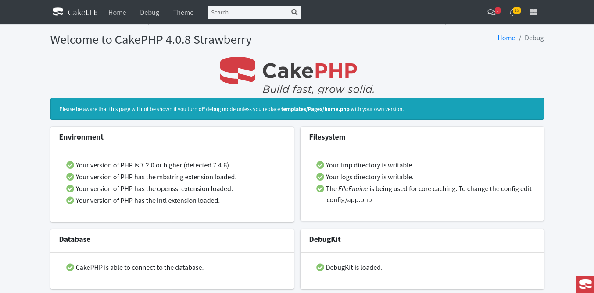

# CakeLTE: AdminLTE plugin for CakePHP 5.x

## Getting Started

### Dependencies

- [FriendsOfCake/bootstrap-ui](https://github.com/FriendsOfCake/bootstrap-ui), transparently use Bootstrap 4 with CakePHP 4.
- [AdminLTE 3.2](https://adminlte.io/), bootstrap 4 admin theme.

### Installing

You can install this plugin into your CakePHP application using [composer](https://getcomposer.org).

The recommended way to install composer packages is:

```bash
composer require arodu/cakelte
```

## Configuration

You can load the plugin using the shell command:

```bash
bin/cake plugin load CakeLte
```

add AdminLTE symlink to webroot
```bash
bin/cake cakelte install
```

## How to use

Copy the file `vendor/arodu/cakelte/config/cakelte.php` to `config/cakelte.php`
```bash
cp vendor/arodu/cakelte/config/cakelte.php config/cakelte.php
```
In this file you can change the cakelte configuration options


use trait into `src/View/AppView.php` _(Recomended)_
```php
namespace App\View;

use Cake\View\View;
use CakeLte\View\CakeLteTrait;

class AppView extends View{
  use CakeLteTrait;

  public string $layout = 'CakeLte.default';

  public function initialize(): void{
      parent::initialize();
      $this->initializeCakeLte();
      //...
  }
}
```

or you can extends from CakeLteView

```php
namespace App\View;

use Cake\View\View;
use CakeLte\View\CakeLteView;

class AppView extends CakeLteView{

  public function initialize(): void{
    parent::initialize();
    //...
  }
}
```

Options layouts

- `CakeLte.default`
- `CakeLte.login`
- `CakeLte.top-nav`

### Create code from bake

```bash
bin/cake bake all [command] -t CakeLte

bin/cake bake template [command] -t CakeLte login
bin/cake bake template [command] -t CakeLte register
bin/cake bake template [command] -t CakeLte recovery
```

To modify the template you can copy one or all the files within your project, copying the following files in the folder `templates/plugin/CakeLte/` and keeping the same structure of `templates/`

Replace the files elements

- Layouts
  - `templates/layout/default.php`
  - `templates/layout/login.php`
  - `templates/layout/top-nav.php`
- Content
  - `templates/element/content/header.php`
- Header navbar
  - `templates/element/header/main.php`
  - `templates/element/header/menu.php`
  - `templates/element/header/messages.php`
  - `templates/element/header/notifications.php`
  - `templates/element/header/search-default.php`
  - `templates/element/header/search-block.php`
- Footer
  - `templates/element/footer/main.php`
- Left sidebar
  - `templates/element/sidebar/main.php`
  - `templates/element/sidebar/menu.php`
  - `templates/element/sidebar/search.php`
  - `templates/element/sidebar/user.php`
- Right sidebar
  - `templates/element/aside/main.php`

Or you can use the following command to copy all files
```bash
bin/cake cakelte copy_file --all
```

## Page debug

Link to debug

```php
echo $this->Html->link(__('CakeLTE debug page'), '/cake_lte/debug' );

// {your-url}/cake_lte/debug
```




## License

This project is licensed under the MIT License - see the [LICENSE](LICENSE) file for details
