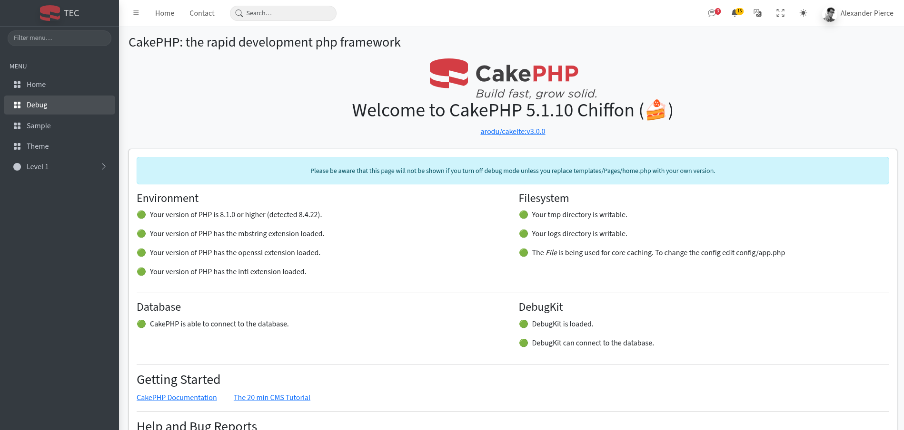

# CakeLTE: AdminLTE plugin for CakePHP 5.x

[](https://github.com/arodu/cakelte/releases)
[](https://cakephp.org/)
[](LICENSE.md)
[](https://github.com/arodu/cakelte/stargazers)
[](https://packagist.org/packages/arodu/cakelte)

If it's helpful you can buy me a coffee, thanks!

[](https://ko-fi.com/H2H3XTSGP)

## Getting Started

### Dependencies

- [FriendsOfCake/bootstrap-ui](https://github.com/FriendsOfCake/bootstrap-ui), transparently use Bootstrap 5 with CakePHP 5.x.
- [arodu/cakephp-bootstrap-tools](https://github.com/arodu/cakephp-bootstrap-tools), helpers for the BootstrapUI + AdminLTE layout.
- [AdminLTE 4.x](https://adminlte.io/), bootstrap 5 admin theme.

### Requirements

- PHP >= 8.2
- CakePHP >= 5.0

### Installing

You can install this plugin into your CakePHP application using [composer](https://getcomposer.org).

The recommended way to install composer packages is:

```bash
composer require arodu/cakelte
```

## Configuration

Load the plugin in `src/Application.php` or with the shell command:

```bash
bin/cake plugin load CakeLte
```

Publish the AdminLTE assets (webroot symlink):

```bash
bin/cake cakelte install
```

> This is a manual step of your application. It is not run automatically by
> composer.

## How to use

Copy the file `vendor/arodu/cakelte/config/cakelte.php` to `config/cakelte.php`

```bash
cp vendor/arodu/cakelte/config/cakelte.php config/cakelte.php
```

In this file you can change the cakelte configuration options (`appName`,
`appLogo`, `layout`, `rtl`). Use the `CakeLte\Enum\Layout` enum for the `layout`
option:
- `Layout::FIXED_SIDEBAR` → `layout-fixed`
- `Layout::FIXED_COMPLETE` → `layout-fixed-complete`
- `Layout::FIXED_MINI` → `layout-fixed sidebar-mini`
- `Layout::FIXED_MINI_COLLAPSED` → `layout-fixed sidebar-mini sidebar-collapse`

The `<body>` of the default layout combines the `layout` classes with the
static AdminLTE suffix: `getBodyClass() + sidebar-expand-lg bg-body-tertiary`.
With the default `Layout::FIXED_SIDEBAR` the rendered body class is
`layout-fixed sidebar-expand-lg bg-body-tertiary`, matching the AdminLTE
starter. The `login` layout uses its own static class (`login-page
bg-body-secondary`) and is not affected by this option.

The sidebar menu is defined in `vendor/arodu/cakelte/config/menu.php`. Copy it
to `config/menu.php` to override the default items.

Use the trait into `src/View/AppView.php` _(Recommended)_

```php
namespace App\View;

use Cake\View\View;
use CakeLte\View\CakeLteTrait;

class AppView extends View
{
    use CakeLteTrait;

    protected string $layout = 'CakeLte.default';

    public function initialize(): void
    {
        parent::initialize();
        $this->initializeCakeLte();
        //...
    }
}
```

`initializeCakeLte()` registers the `CakeLte.CakeLte` helper, the BootstrapUI
helpers and the menu helpers (`Menu` and `MenuLte`).

Options layouts

- `CakeLte.default`
- `CakeLte.login`

### Create code from bake

```bash
bin/cake bake all [command] -t CakeLte

bin/cake bake template [command] -t CakeLte login
bin/cake bake template [command] -t CakeLte register
bin/cake bake template [command] -t CakeLte recovery
```

### Customize templates

To modify the templates you can copy one or all the files within your project,
copying the following files into the folder `templates/plugin/CakeLte/` keeping
the same structure of `templates/`:

- Layouts
  - `templates/layout/default.php`
  - `templates/layout/login.php`
- Content
  - `templates/element/content/header.php`
- Header navbar
  - `templates/element/header/main.php`
  - `templates/element/header/menu.php`
  - `templates/element/header/search.php`
  - `templates/element/header/messages.php`
  - `templates/element/header/notifications.php`
  - `templates/element/header/fullscreen.php`
  - `templates/element/header/user.php`
- Footer
  - `templates/element/footer/main.php`
- Left sidebar
  - `templates/element/sidebar/main.php`
  - `templates/element/sidebar/menu.php`

Or you can use the following command to copy all files:

```bash
bin/cake cakelte copy_files --all
```

You can also copy a single category:

```bash
bin/cake cakelte copy_files sidebar
```

## Page debug

Link to debug

```php
echo $this->Html->link(__('CakeLTE debug page'), '/cakelte/debug');

// {your-url}/cakelte/debug
```



## Support

If you have any problems or questions, please open an issue on
[GitHub](https://github.com/arodu/cakelte/issues).

## License

This project is licensed under the MIT License - see the [LICENSE](LICENSE) file for details